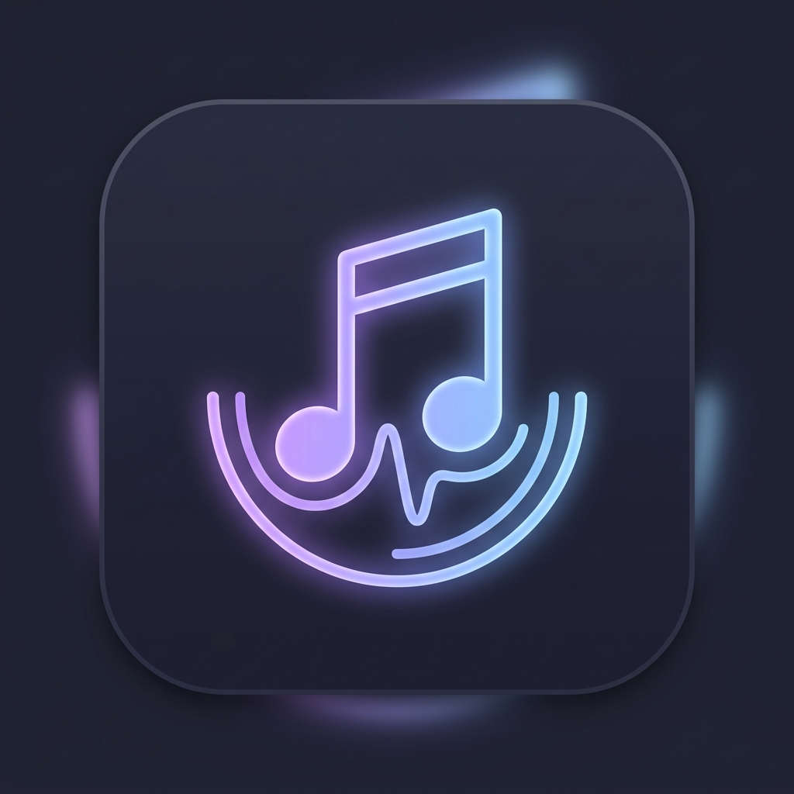
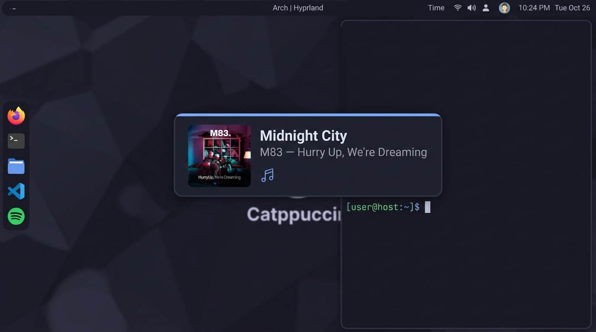
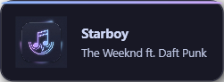
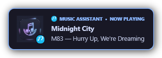
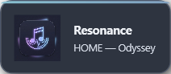
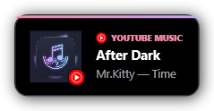
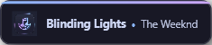
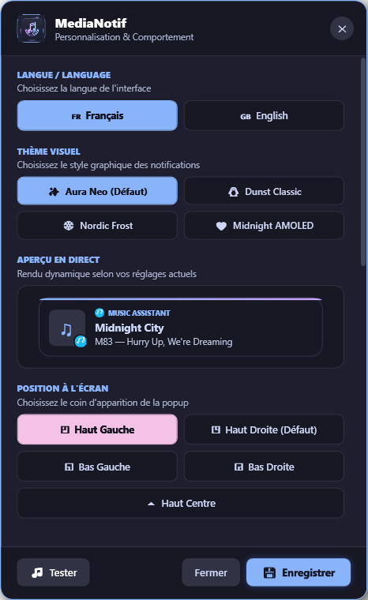
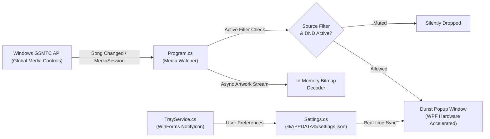

<div align="center">



# MediaNotif

**Sleek, lightweight Dunst-inspired desktop notifications for YouTube Music & Windows media players.**

A distraction-free Windows utility that delivers beautiful Catppuccin Mocha song change popups without stealing focus or lagging your workflow.

[-0078D6?logo=windows&logoColor=white)](https://microsoft.com/windows)
[](https://dotnet.microsoft.com/)
[](https://github.com/catppuccin/catppuccin)
[](LICENSE)
[](https://github.com/username/medianotif)



</div>

---

## 💡 Why MediaNotif?

Default Windows Toast notifications are bulky, sluggish, and often clutter the Action Center with redundant alerts. When listening to music in the background or gaming in fullscreen, you just want to know what song is playing without a heavy notification banner stealing your keyboard focus or dropping your framerate.

Inspired by the minimalism of **Dunst** on Linux and styled with the **Catppuccin Mocha** color palette, **MediaNotif** runs silently in the background, hooks directly into Windows media transport controls (GSMTC), and renders sleek, hardware-accelerated popups that dismiss themselves gracefully.

---

## ✨ Features

- 🎨 **Multi-Theme Engine (Classic Dunst & Modern Aura)** — Switch seamlessly between **Aura Neo** (neon gradient top bar & glow), **Classic Dunst** (original Linux Dunst blue border with bold `NOW PLAYING` tag), **Nordic Frost** (cool arctic cyan), and **Midnight AMOLED** (pitch black with vivid accents).
- 🎵 **Universal Media Support** — Works out-of-the-box with **YouTube Music** (Chrome, Edge, Brave, Firefox, Zen, Opera, PWA, or Desktop client), **Spotify**, and any Windows SMTC-compatible media player.
- 🎧 **Smart Source Filtering** — Isolate notifications to your favorite music app (e.g., only YouTube Music or Spotify) to ignore background browser video playbacks.
- 🖼️ **In-Memory Cover Art Pipeline** — Decodes album artwork 100% in RAM with zero disk I/O or temporary file locking, backed by an asynchronous retry mechanism for late-arriving metadata.
- 🖥️ **Multi-Monitor & Topmost Precision** — Place notifications in any of 5 screen positions (*Top-Right, Top-Left, Bottom-Right, Bottom-Left, Top-Center*) with native `SetWindowPos(HWND_TOPMOST)` rendering over borderless and fullscreen windows.
- 🔕 **Do Not Disturb Mode** — Silence popups on demand in 1 click from the tray menu or settings panel.
- 📱 **Ultra-Compact Mode** — A minimal ~42px single-line layout (`Title • Artist`) crafted specifically for gamers and compact desktop real estate.
- 🪶 **Zero Focus Stealing** — Built with native Win32 `WS_EX_NOACTIVATE` and `WS_EX_TOOLWINDOW` flags: never interrupts keystrokes, games, or shows up in `Alt + Tab`.
- 🌐 **Instant Bilingual UI** — Switch between English and French with a single click across all menus, tooltips, and settings.
- ⚙️ **Modern Fluent Settings Panel** — Live interactive preview, real-time theme selector, custom durations (1.5s–8.0s), customizable width (340px–480px), and optional Windows startup on user login without administrator privileges.

---

## 🎨 Visual Themes & Customization

MediaNotif comes packed with 4 distinct visual styles plus an ultra-compact mode:

| ✨ Aura Neo (Default) | 🐧 Classic Dunst (Original) |
|:---:|:---:|
|  |  |

| ❄️ Nordic Frost | 🖤 Midnight AMOLED |
|:---:|:---:|
|  |  |

### 📱 Ultra-Compact Mode (In-Game / Minimalist)
<div align="center">
  
</div>

### ⚙️ Settings Panel
<div align="center">
  
</div>

---

## 🚀 Quick Start

### 1. Pre-built Executable
Download the latest release and run `MediaNotif.exe`. The application sits quietly in your Windows system tray.

### 2. Run from Source
Make sure you have the [.NET 6 SDK](https://dotnet.microsoft.com/download/dotnet/6.0) installed:

```powershell
# Clone the repository
git clone https://github.com/username/medianotif.git
cd medianotif

# Launch in normal listening mode
dotnet run

# Launch and display an immediate test notification
dotnet run -- --test
```

---

## 🛠️ Build from Source

### Prerequisites
- Windows 10 (Build 19041+) or Windows 11
- [.NET 6.0 SDK](https://dotnet.microsoft.com/download/dotnet/6.0) (with Windows Desktop workload)

### Build Self-Contained Single Executable (.exe)
To produce a portable, standalone `.exe` without requiring a global .NET runtime:

```powershell
dotnet publish -c Release -r win-x64 --self-contained false -p:PublishSingleFile=true -o ./publish
```

The optimized executable will be generated at `./publish/MediaNotif.exe`.

---

## ⚙️ Configuration

Custom settings and runtime logs are saved in your local Windows user profile:
- **Directory**: `%APPDATA%\MediaNotif\` (`C:\Users\<User>\AppData\Roaming\MediaNotif\`)
- **Config File**: `settings.json`
- **Application Log**: `medianotif.log`

### Config Schema (`settings.json`)

| Option | Type | Default | Description |
|---|---|---|---|
| `Position` | `string` | `"TopRight"` | Screen anchor: `TopRight`, `TopLeft`, `BottomRight`, `BottomLeft`, `TopCenter` |
| `Theme` | `string` | `"AuraNeo"` | Visual theme: `AuraNeo`, `ClassicDunst`, `NordicFrost`, `MidnightAmoled` |
| `DisplayDurationSeconds` | `double` | `3.5` | Display duration in seconds before fade-out (`1.5` to `8.0`) |
| `NotificationWidth` | `double` | `420.0` | Width of notification card in pixels (`340` to `480`) |
| `CompactMode` | `boolean` | `false` | Enable ultra-slim single line layout (~42px height) |
| `MediaSourceFilter` | `string` | `"All"` | Filtered audio source (`All`, `YouTubeMusic`, `Spotify`, `Zen`, `Chrome`, `Firefox`, `Edge`, `Brave`) |
| `DoNotDisturb` | `boolean` | `false` | Mute all visual notifications |
| `Language` | `string` | `"fr"` | UI language (`"fr"` for French, `"en"` for English) |
| `StartWithWindows`| `boolean` | `false` | Launch silently on user login (`HKCU\Software\Microsoft\Windows\CurrentVersion\Run`) |

---

## 🏗️ Architecture & How It Works



- **`Program.cs`** — Background GSMTC listener, P/Invoke Win32 window handle styler (`WS_EX_NOACTIVATE`, `WS_EX_TOOLWINDOW`, `HWND_TOPMOST`), and non-blocking WPF animation dispatchers.
- **`SettingsWindow.cs`** — Fluent Catppuccin configuration window with live interactive card preview and instant reactive state updates.
- **`TrayService.cs`** — System notification tray icon (`♫`) with quick audio source switcher, test triggers, and localization bindings.
- **`Settings.cs`** — Atomic JSON persistence and Windows User Run registry management (no admin rights required).

---

## 🤝 Contributing

Contributions, bug reports, and feature suggestions are warmly welcomed!
1. Fork the project
2. Create your feature branch (`git checkout -b feature/AmazingFeature`)
3. Commit your changes (`git commit -m "feat: add AmazingFeature"`)
4. Push to the branch (`git push origin feature/AmazingFeature`)
5. Open a Pull Request

---

## 📄 License & Credits

- **Code License:** [MIT](LICENSE)
- **Design Inspiration:** [Dunst Project](https://github.com/dunst-project/dunst) & [Catppuccin Theme](https://github.com/catppuccin/catppuccin)

<div align="center">

**If you like MediaNotif, please consider leaving a ⭐ on GitHub!**

[Report a Bug](https://github.com/username/medianotif/issues) · [Request Feature](https://github.com/username/medianotif/issues)

</div>
